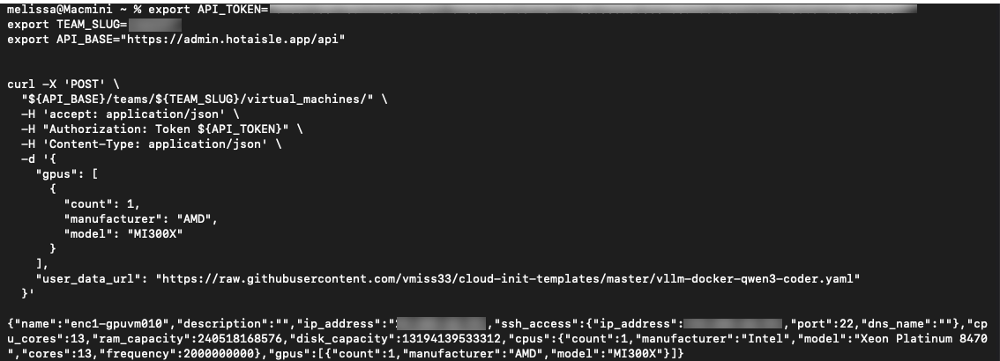
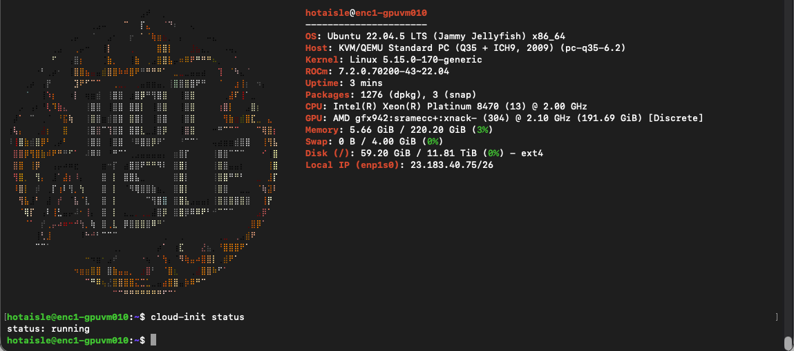
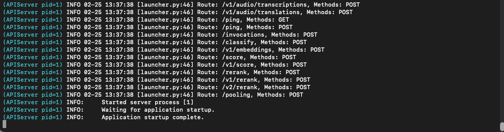
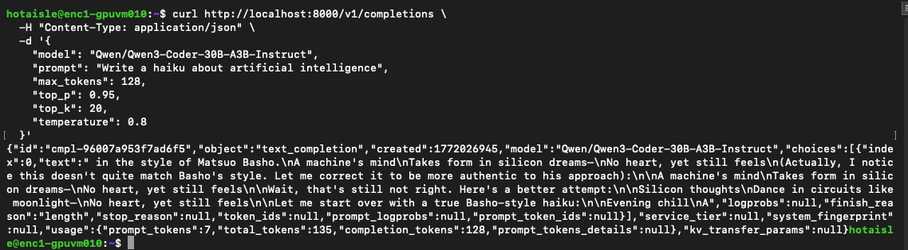
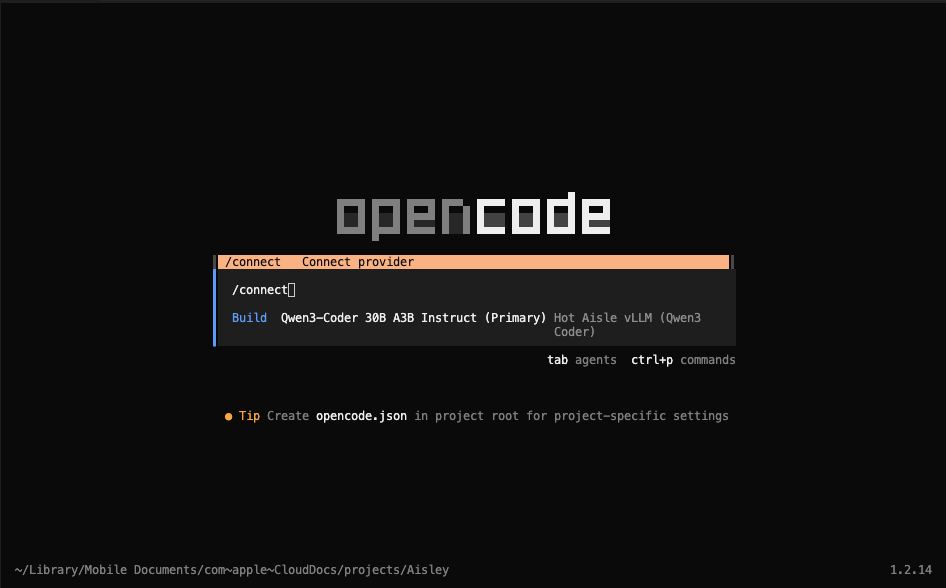
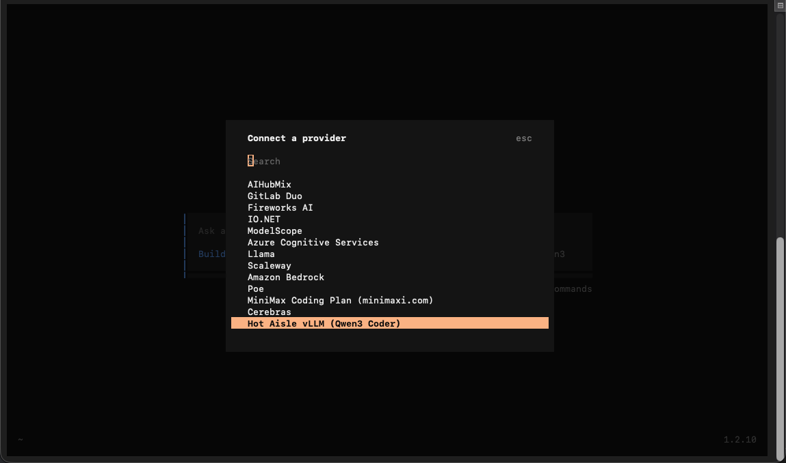
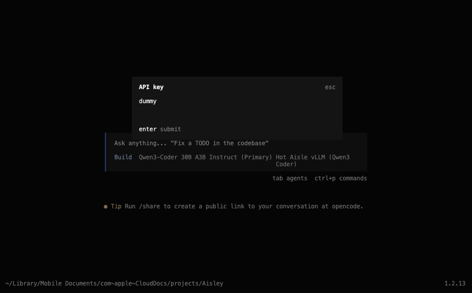
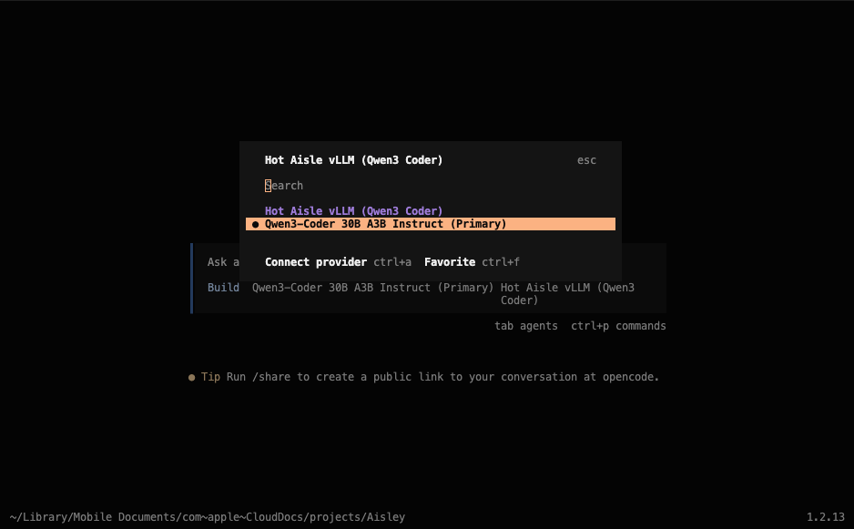
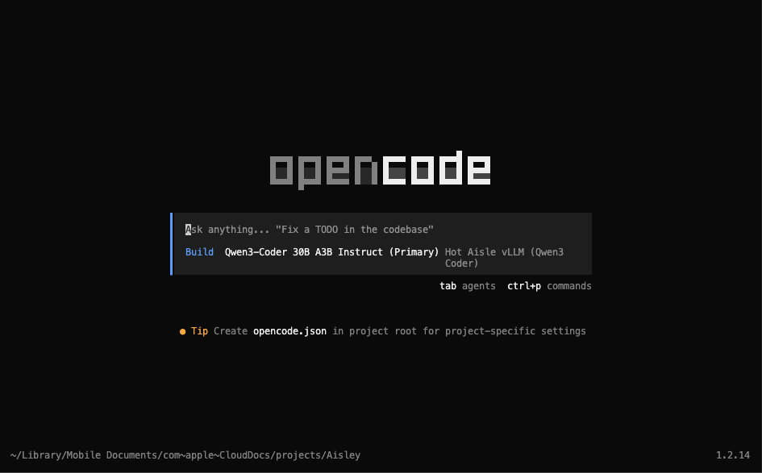
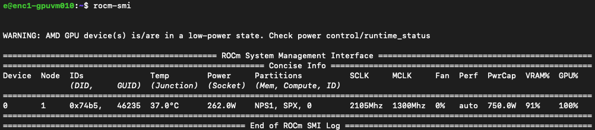

# Connecting OpenCode to vLLM on HotAisle

Slug: opencode-vllm-hotaisle
Publish: Yes
Meta Title: Connecting OpenCode to vLLM on HotAisle
Meta Description: Step-by-step guide to running OpenCode against a self-hosted vLLM server on HotAisle using an AMD MI300X, with notes on tool calling, SSH tunneling, and GPU memory concurrency tradeoffs.
Meta Keywords: Hot Aisle, HotAisle, vLLM, OpenCode, AMD, MI300X, ROCm, coding agents, tool calling, KV cache, concurrency, SSH tunnel
Author: Melissa Palmer
Date: 02/26/2026
Description: Step-by-step guide to connecting OpenCode to a self-hosted vLLM instance on HotAisle using an AMD MI300X GPU.  Includes tool calling flags, SSH tunneling, and how context length impacts KV cache and concurrency.
Featured: No
Tags: GPU, vLLM, OpenCode, ROCm, Agents

# Connecting OpenCode to vLLM on HotAisle

If you’re looking for effectively unlimited tokens with a predictable hourly cost, connecting OpenCode to a self-hosted vLLM instance on HotAisle is a great way to get out of token jail.

Instead of paying per request, you run your own model on dedicated GPUs and let OpenCode interact with it over an API endpoint just like a hosted provider.  The difference is that you control the hardware, the cost model, and the data.

Because the model runs on dedicated GPU infrastructure, costs are tied to hardware time rather than per-token usage.  This can be helpful during development and experimentation, since iterative workflows such as coding agents often involve many repeated prompts, tool calls, and refinements.  When the infrastructure is already running, additional experimentation does not change costs until you scale the hardware itself, which can make it easier to explore configurations and workflows without constantly thinking about token consumption.

In this guide, we’ll deploy a VM on HotAisle and connect it to OpenCode using vLLM as the inference server.  The VM used in this example includes 1 × AMD MI300X GPU with 192 GB of VRAM.  For the model, we are using **Qwen/Qwen3-Coder-30B-A3B-Instruct**, which has been working well for coding workflows.  We’ll also cover a few important configuration details that matter specifically for coding agents.

## **What is OpenCode?**

OpenCode is an open-source coding agent and developer assistant that connects to language models to help write, modify, and reason about code inside your local development environment.  Unlike traditional chat interfaces, OpenCode is designed to interact directly with your project by reading files, editing code, executing commands, and iterating based on results, which makes it especially powerful for real development workflows. 

It supports multiple model providers, including self-hosted inference servers like vLLM, allowing you to run coding agents on your own infrastructure instead of relying on hosted APIs.  You can learn more about OpenCode and install it from the official site: https://opencode.ai

## **HotAisle + vLLM Basics**

New to HotAisle or vLLM? Here’s what to know before we get started.

HotAisle provides access to dedicated GPU infrastructure with predictable hourly pricing, which makes it a great fit for running your own models instead of paying per-token API costs. Instead of sending prompts to a hosted provider, you deploy a virtual machine with GPUs, load a model locally, and expose it through an API endpoint.

vLLM is the component that makes this practical. It is an optimized inference server designed for large language models that focuses on efficient GPU utilization, high throughput, and fast response times. vLLM handles model loading, token generation, batching, and memory management (including KV cache allocation), and exposes an OpenAI-compatible API that tools like OpenCode can connect to directly. In other words, vLLM is the bridge between your GPU hardware and your coding assistant.

In this setup, OpenCode runs locally on your machine while the language model runs remotely on a HotAisle GPU VM. The two communicate over a secure SSH tunnel, allowing OpenCode to interact with the remote model just like it would with a hosted API provider.

vLLM runs inside a Docker container on the HotAisle VM and exposes an OpenAI-compatible API endpoint that OpenCode connects to. This separation allows you to use powerful remote GPUs while keeping your development workflow local.  Running vLLM in Docker simplifies dependency management and makes deployments reproducible, since the ROCm runtime, model libraries, and server configuration are packaged together rather than installed directly on the host operating system.

Essentially, the architecture looks like this:

```
OpenCode → SSH Tunnel → HotAisle VM → vLLM → GPU → Model
```

Now, let's walk through getting started.

## Deploying Your VM and Model

HotAisle is simple to get started with.  You can start with issuing the following command at your terminal:

```
ssh admin.hotaisle.app
```

Yes, that's really it.  You can find more details at the [quick-start guide here.](https://hotaisle.xyz/quick-start)

While you're in the HotAisle TUI, we will also need to generate an API token and take note of our team name when we create it, because we will need them to deploy a VM with cloud-init.

HotAisle has cloud-init templates here: https://github.com/hotaisle/cloud-init-templates, along with a walk through to get started.

You can find my fork of the cloud-init templates here: https://github.com/vmiss33/cloud-init-templates.  You can find the template I used in this example, as well as the other templates I am using for other projects.

The cloud-init file I used is as follows:

```yaml
#cloud-config
#Get Qwen3 Coder Next running.

runcmd:
  - |
    echo "Starting vLLM Docker container..."
    docker rm -f vllm || true
    docker run -d \
      --name vllm \
      --network=host \
      --group-add=video \
      --ipc=host \
      --cap-add=SYS_PTRACE \
      --security-opt seccomp=unconfined \
      --privileged \
      --device /dev/kfd \
      --device /dev/dri \
      --restart=always \
      rocm/vllm:latest \
      vllm serve Qwen/Qwen3-Coder-30B-A3B-Instruct \
        --max-model-len 131272 \
        --block-size 256 \
        --enable-auto-tool-choice \
        --tool-call-parser qwen3_xml
  - |
    echo "vLLM container started. Check status with: docker logs -f vllm"
    echo "API should be available on port 8000 (host networking)."
```

If you are new to vLLM, here are some details on how it is configured for this example:

## vLLM Configuration Explained

If you are new to vLLM, or have not played with it that much, here are a few things that we need to consider:

`vllm serve Qwen/Qwen3-Coder-30B-A3B-Instruct \`

​        `--max-model-len 131272 \`

​        `--block-size 256 \`

​        `--enable-auto-tool-choice \`

​        `--tool-call-parser qwen3_xml`

`Max-model-len` is the maximum context window that the model is to support.  Each model will specify what it's maximum context length is, and you may tweak this value according to your needs.  vLLM allocates KV cache based on the context length, and it is important to remember that the KV cache lives in GPU memory.  Remember, within our GPUs we need to consider the weight of the model as well as the KV cache size.

`Block-size` controls how vLLM allocates memory blocks for the KV cache.  Larger values can improve efficiency for long contexts, but this can become a sizing/architectural concern based on the number of concurrent users.

`Qwen/Qwen3-Coder-30B-A3B` is the model we are using.  Want to try a different model?  This is the line to replace here in your cloud-init file/docker run command, and in the OpenCode configuration.

`Enable-auto-tool-choice` allows the model to decide when it needs to use tooling.

`tool-call-parser qwen3_xml` is the tool parser for the qwen3 family of models, there are multiple tool parsers available in vLLM.  I have found this one to work best.

## **Understanding GPU Memory and Concurrency**

When running models locally, GPU memory usage is not determined by the model size alone. There are two primary components that consume GPU memory:

1. Model weights
2. KV cache (context memory)

KV cache stores attention data for every token in the conversation and grows linearly with context length. This means that parameters like --max-model-len directly impact GPU memory usage because vLLM allocates memory for the maximum possible context window.

In this example, I am running on an AMD MI300X GPU, which has 192GB of VRAM. This large memory capacity makes it possible to run larger models and longer contexts comfortably, but the same principles apply on smaller GPUs.

One of the most important concepts to understand is that KV cache does not just affect whether the model fits in memory, it also impacts concurrency.  The more memory allocated for context, the fewer simultaneous requests the GPU can handle. Larger context windows increase flexibility for long prompts and coding workflows, but they reduce how many sessions can run in parallel.

This creates a tradeoff between:

- Context length
- Concurrency
- GPU memory usage

Coding agents like OpenCode typically consume context faster than traditional chat workloads because tool outputs, file contents, command results, and iterative reasoning steps are all added back into the prompt.  This means context length and KV cache sizing become more important when running agents than when running conversational assistants.  In practice, agent workloads often benefit from larger context windows, but this also increases memory usage and reduces concurrency, reinforcing the importance of understanding GPU memory tradeoffs.

For coding agents like OpenCode, longer contexts are often beneficial because tool outputs, file contents, and iterative reasoning can quickly increase token counts.  However, understanding how KV cache impacts concurrency becomes important when scaling beyond a single user or running multiple sessions.

Tools like `rocm-smi` are useful during experimentation to monitor memory allocation and GPU utilization while the model is running.

### Tooling in vLLM

The tooling aspect of vLLM is the biggest difference between using OpenCode and using a language model as a simple chatbot.

OpenCode relies heavily on tool calling to function as a coding agent rather than just a text generator. Instead of only producing code suggestions, the model must be able to decide when to interact with the environment, such as reading files from the repository, modifying code, executing commands, running tests, and then inspecting the results before continuing.

This creates an iterative loop where the model alternates between reasoning and taking actions.

The --enable-auto-tool-choice flag allows the model to autonomously decide when a tool should be used during that process rather than requiring the application to force tool usage.

The --tool-call-parser qwen3_xml flag tells vLLM how to interpret the structured tool calls emitted by Qwen3-family models, which use an XML-based format to represent tool invocations. Without the correct parser, vLLM would treat those tool calls as plain text instead of actionable instructions.

Together, these flags enable OpenCode to operate correctly by allowing the model to both decide when tools are needed and communicate those decisions in a format the runtime can execute.

## After Building the VM

After issuing the command to build the VM, you will see the following returned in your terminal in a moment or two.

You can call your cloud-init script as follows, illustrated in the Hot Aisle cloud-init repo.  I've put the file I used in my fork in this example.

```bash
export API_TOKEN="your-api-token-here"
export API_BASE="https://admin.hotaisle.app/api"
export TEAM_SLUG="your-team"

curl -X 'POST' \
  "${API_BASE}/teams/${TEAM_SLUG}/virtual_machines/" \
  -H 'accept: application/json' \
  -H "Authorization: Token ${API_TOKEN}" \
  -H 'Content-Type: application/json' \
  -d '{
    "gpus": [
      {
        "count": 1,
        "manufacturer": "AMD",
        "model": "MI300X"
      }
    ],
    "user_data_url": "https://raw.githubusercontent.com/vmiss33/cloud-init-templates/master/vllm-docker-qwen3-coder.yaml"
  }'
```



**Take note of the IP address of your VM at this step.**

Between deploying the VM and starting vLLM, it will take about five minutes.  Most of this time is model download and GPU initialization.  You can check the status of cloud init with the command:

```bash
cloud-init status
```



you can check the status of vLLM using the following command

```bash
docker logs -f vllm
```



The Application startup complete line indicates the model has completed loading.

You can test your with the following code:

```bash
curl http://localhost:8000/v1/completions \
  -H "Content-Type: application/json" \
  -d '{
    "model": "Qwen/Qwen3-Coder-30B-A3B-Instruct",
    "prompt": "Write a haiku about artificial intelligence",
    "max_tokens": 128,
    "top_p": 0.95,
    "top_k": 20,
    "temperature": 0.8
  }'
```

Here's the type of output you are looking for, an entertaining haiku:



## Create OpenCode Configuration File

Create a JSON file to serve as the OpenCode configuration file

~/.*config/opencode/opencode.json*

Here is what mine looks like:

```json
{
  "$schema": "https://opencode.ai/config.json",
  "provider": {
    "vllm-hotaisle": {
      "npm": "@ai-sdk/openai-compatible",
      "name": "Hot Aisle vLLM (Qwen3 Coder)",
      "options": {
        "baseURL": "http://localhost:8000/v1",
        "apiKey": "sk-no-key-required"
      },
      "models": {
        "Qwen/Qwen3-Coder-30B-A3B-Instruct": {
          "name": "Qwen3-Coder 30B A3B Instruct (Primary)",
          "limit": {
            "context": 131072,
            "output": 8192
          }
        }
      }
    }
  },
  "model": "vllm-hotaisle/Qwen/Qwen3-Coder-30B-A3B-Instruct",
  "permission": {
    "edit": "allow",
    "bash": "allow"
  }
}
```

Note: You can only have one model at a time in the file, so if you need to switch modes, don't forget to update the model line of this file.

## Create a SSH Tunnel to the HotAisle VM

Create a ssh tunnel to the HotAisle VM:

```bash
ssh -N -L 8000:localhost:8000 hotaisle@x.x.x.x
``` 

where x.x.x.x is the IP of your HotAisle VM.

## Connect to OpenCode

Launch OpenCode, and type /connect, then hit enter.



Note: I personally use the OpenCode extension in VS Code.

Scroll all the way down to the bottom and look for "Hot Aisle vLLM (Qwen3 Coder)".  This was in our configuration file.



You do not need an API key, so if you are prompted for one just enter some text, I like to use "dummy".



Next, you can select the model you wish to use.



The text **Hot Aisle vLLM (Qwen 3 Coder)** is the name I gave this provider in the configuration file, and **Qwen3-Coder 30B A3B Instruct** is the model we are using, which was also specified in the configuration file.  You may see different values here based on your setup.

Going forward, OpenCode will remember your selection.  You can now see that OpenCode is connected to the model, and you can issue a prompt to get coding.



## Other Helpful Hints

Hot Aisle is powered by AMD GPUs and the VM I deployed has 1 x MI300X.  This GPU has 192GB of VRAM.

The most useful command to know out of the gate if you are going to experiment with different models is:

```bash
rocm-smi
```



ROCm System Management Interface allows you to monitor your GPU.  ROCm or Radeon Open Compute is AMD's GPU software platform.  This command is comparable to nvidia-smi if you have used NVIDIA hardware in the past.

## Why This Setup Is Powerful

Running OpenCode against a self-hosted vLLM instance changes the development experience significantly.  Instead of worrying about token costs or API limits, you can iterate freely, experiment with different prompts, and run complex agent workflows without friction.  This makes remote GPU infrastructure especially valuable for development, research, and prototyping scenarios where experimentation speed matters more than per-request efficiency.

While self-hosting introduces additional infrastructure considerations such as GPU memory sizing and concurrency management, tools like vLLM make it much more accessible than traditional inference stacks.  Once configured, the workflow feels very similar to using a hosted provider, but with full control over hardware, data, and configuration.

## Useful Links

Here are the main tools and resources used in this guide:

- OpenCode — coding agent: https://github.com/opencode-ai/opencode
- vLLM — inference server: https://github.com/vllm-project/vllm
- HotAisle — Simple, hourly GPU infrastructure: https://hotaisle.xyz
- HotAisle cloud-init-templates Repo: https://github.com/hotaisle/cloud-init-templates

My Fork of Hot Aisle's cloud-init-templates:

- https://github.com/vmiss33/cloud-init-templates

*Melissa Palmer is an infrastructure architect exploring the messy intersection of GPUs, software, and real-world workloads.*
LinkedIn: https://www.linkedin.com/in/vmiss
X (Twitter): https://x.com/vmiss33
GitHub: https://github.com/vmiss33